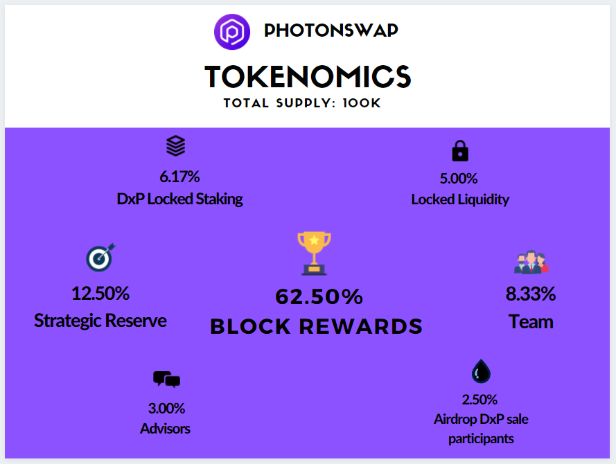

# Tokenomics

>**Ticker** : PHOTON Token\
>**Contract address:** 0xbdd4e5660839a088573191A9889A262c0Efc0983\
>**Chain** : Cronos(CRO20)
>
>View the [Photonswap: Photon Token Contract on Cronoscan](https://cronoscan.com/address/0xbdd4e5660839a088573191A9889A262c0Efc0983).

## The Basic
PHOTON Token is the token that powers the PhotonSwap ecosystem.

## In Detail

It is important to remark that the Team Tokens (15%) are vested following the same schedule as those tokens acquired by the community via our private and public sales. Right after the start of PHOTON trading, 15% of the team tokens will be unvested. Afterwards, 7.73% of said tokens will be unvested on a monthly basis until all purchased tokens have been released.
Partnership and Advisor tokens are also vested, following individual schedules as agreed with our partners. The PHOTONSWAP team shall reveal any new partners and advisors, and the vesting periods agreed with them.
